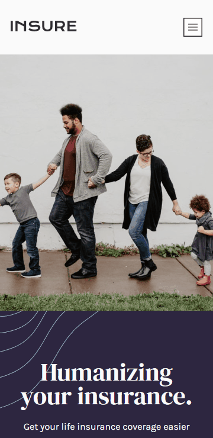
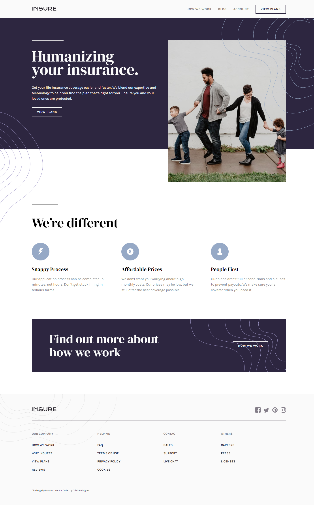

# Sobre o Projeto
Projeto clone do desafio [FrontEnd Mentor](https://www.frontendmentor.io/challenges/insure-landing-page-uTU68JV8) 

## Desing Mobile	

## Design Desktop

# Tecnologias utilizadas
* HTML
* SASS
* JS

### Observação
* Utilizado Extensão do VSCODE Live SASS Compiler para gerar o CSS estatico (main.css)
